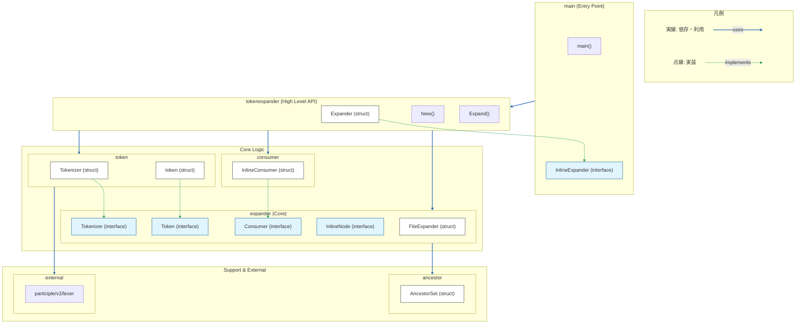

```mermaid
flowchart TB
    %% スタイルの定義
    classDef main fill:#f9f,stroke:#333,stroke-width:2px;
    classDef package fill:#f5f5f5,stroke:#666,stroke-width:1px,stroke-dasharray: 5 5;
    classDef struct fill:#fff,stroke:#333,stroke-width:1px;
    classDef interface fill:#e1f5fe,stroke:#01579b,stroke-width:1px;
    classDef external fill:#fff3e0,stroke:#ef6c00,stroke-width:1px;

    %% 凡例 (Legend)
    subgraph Legend ["凡例"]
        direction LR
        L1[実線: 依存・利用] -- "uses" --> L2[ ]
        L3[点線: 実装] -. "implements" .-> L4[ ]
        style L1 fill:none,stroke:none
        style L2 fill:none,stroke:none
        style L3 fill:none,stroke:none
        style L4 fill:none,stroke:none
        linkStyle 0 stroke:#2b6cb0,stroke-width:2px;
        linkStyle 1 stroke:#38a169,stroke-width:2px;
    end

    %% 各パッケージの定義
    subgraph mainpkg ["main (Entry Point)"]
        MainFunc["main()"]
        InlineExpanderIfc["InlineExpander (interface)"]
    end
    class mainpkg main;
    class InlineExpanderIfc interface;

    subgraph tokenexpanderpkg ["tokenexpander (High Level API)"]
        ExpanderStruct["Expander (struct)"]
        NewExpander["New()"]
        ExpandMethod["Expand()"]
    end
    class ExpanderStruct struct;

    subgraph core_logic ["Core Logic"]
        subgraph expanderpkg ["expander (Core)"]
            FileExpanderStruct["FileExpander (struct)"]
            TokenizerIfc["Tokenizer (interface)"]
            TokenIfc["Token (interface)"]
            InlineNodeIfc["InlineNode (interface)"]
            ConsumerIfc["Consumer (interface)"]
        end

        subgraph consumerpkg ["consumer"]
            InlineConsumerStruct["InlineConsumer (struct)"]
        end

        subgraph tokenpkg ["token"]
            TokenizerStruct["Tokenizer (struct)"]
            TokenStruct["token (struct)"]
        end
    end
    class FileExpanderStruct,InlineConsumerStruct,TokenizerStruct,TokenStruct struct;
    class TokenizerIfc,TokenIfc,InlineNodeIfc,ConsumerIfc interface;

    subgraph low_level ["Support & External"]
        subgraph ancestorpkg ["ancestor"]
            AncestorSetStruct["AncestorSet (struct)"]
        end
        subgraph external ["external"]
            ParticipleLexer["participle/v2/lexer"]
        end
    end
    class AncestorSetStruct struct;
    class external external;

    %% 依存関係 (Uses) - 青色の実線
    mainpkg ==> tokenexpanderpkg
    tokenexpanderpkg --> expanderpkg
    tokenexpanderpkg --> consumerpkg
    tokenexpanderpkg --> tokenpkg
    expanderpkg --> ancestorpkg
    tokenpkg --> external

    %% 実装関係 (Implements) - 緑色の点線
    ExpanderStruct -.-> InlineExpanderIfc
    InlineConsumerStruct -.-> ConsumerIfc
    TokenizerStruct -.-> TokenizerIfc
    TokenStruct -.-> TokenIfc

    %% リンクスタイルの適用
    linkStyle 2,3,4,5,6,7 stroke:#2b6cb0,stroke-width:2px;
    linkStyle 8,9,10,11 stroke:#38a169,stroke-width:2px;
```